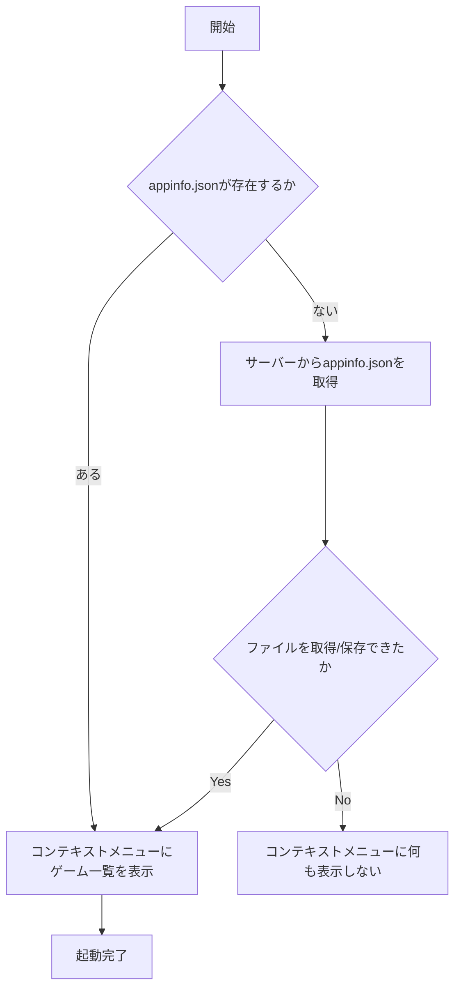
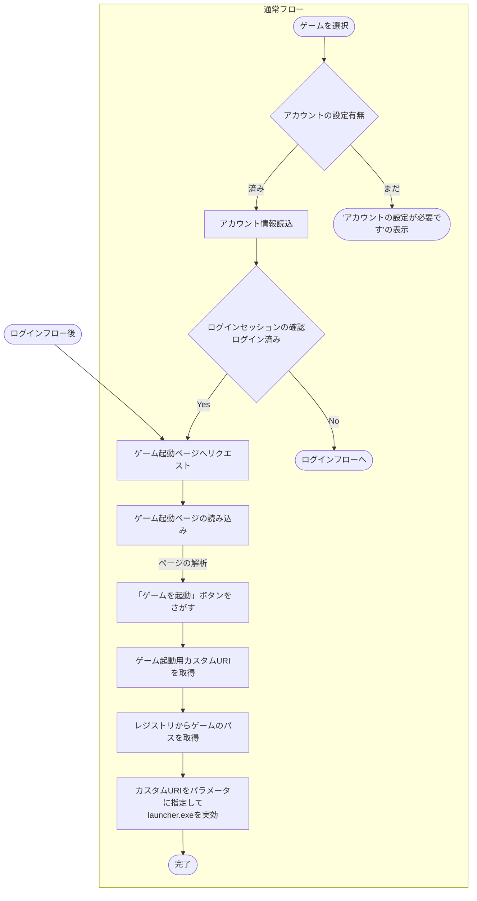
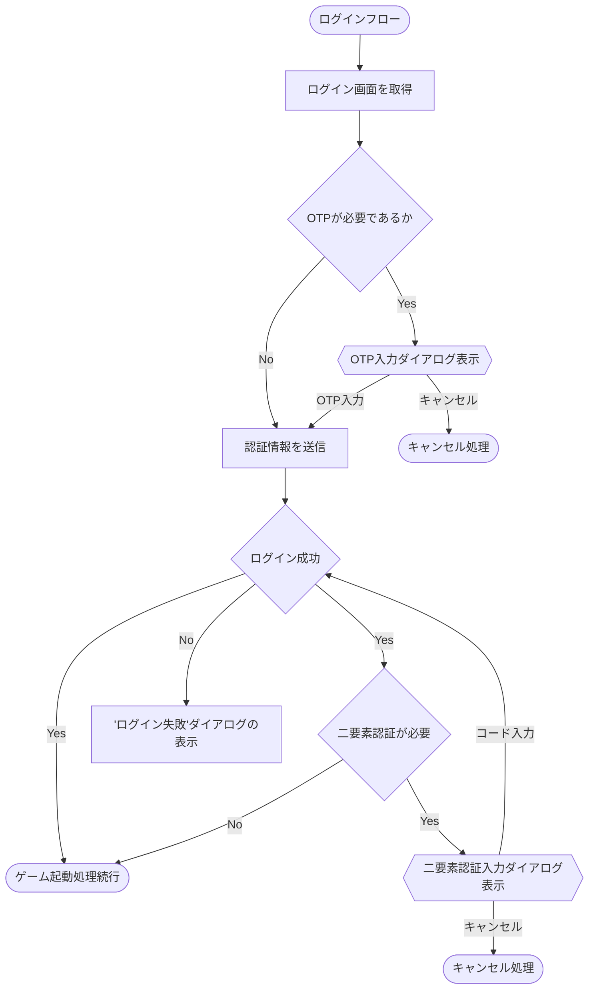

Ks Game Launcher
====
[](https://github.com/anon5r/KSGameLauncher/releases/latest) [](https://github.com/anon5r/KSGameLauncher/releases/latest)
<a href="https://github.com/anon5r/KSGameLauncher/releases"></a>

[English](README.md)


<p align="center">
  <a href="https://github.com/anon5r/KSGameLauncher/releases">
    
  </a>
</p>


# これは何？

コナステのゲームをワンクリックで起動するためのアプリケーションです。

動作、機能などの詳細は[こちらのドキュメント](https://launcher-app.sdvx.net/index.ja.html)を確認してください。


## 処理フロー

### 起動



### ゲーム起動フロー




### ログインフロー




# 開発環境

OS: Microsoft&reg; Windows&trade; 10 以上

必要ランタイム: Microsoft&reg; .NET Framework 4.8

インストールが必要な場合は [こちら](https://docs.microsoft.com/ja-jp/dotnet/framework/install/on-windows-10) からインストールしてください。


## オプショナル

- Docker


# ビルド方法

Microsoft&reg; Visual Studio、または [MSBuild](https://docs.microsoft.com/ja-jp/visualstudio/msbuild/msbuild?view=vs-2022) を用いてビルドすることができます。

## NuGet

いくつかのNuGetライブラリを使用しています。

それらをインストールするためにNuGetから復元する必要があります。

```
nuget restore KsGameLauncher.sln
```


# デバッグ

一部、サーバーからデータをダウンロードする機能があります。
これをシミュレートするために簡易WebサーバーとしてDockerイメージを同梱しています。


## イメージのビルド

```
docker compose build
```

## コンテナの作成、起動

```
docker compose up -d
```

サーバーはポート `8080` で起動します。
接続先 `http://localhost:8080`

ゲーム一覧となる `appinfo.json` は `http://localhost:8080/conf/appinfo.json` となります。


## コンテナの停止

```
docker compose stop
```

## コンテナの削除

```
docker compose down
```

## トラブルシュート

既存のポートと重複する場合は `docker-compose.yml` の `services.web.ports` で変更してください。
