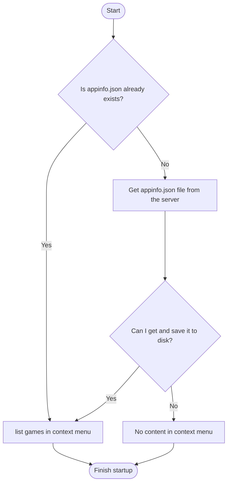
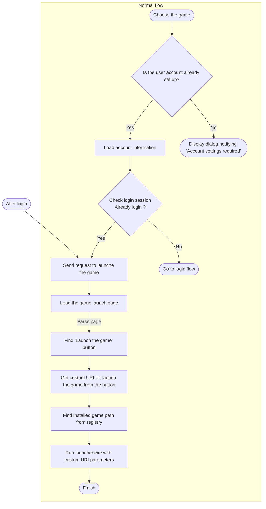
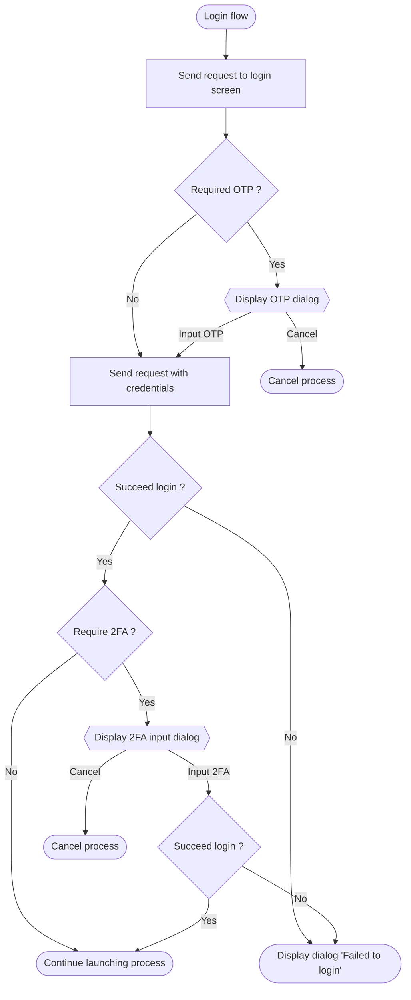

Ks Game Launcher
====
[](https://github.com/anon5r/KSGameLauncher/releases/latest) [](https://github.com/anon5r/KSGameLauncher/releases/latest)
<a href="https://github.com/anon5r/KSGameLauncher/releases"></a>

[Japanese (日本語)](README.ja-JP.md)


<p align="center">
  <a href="https://github.com/anon5r/KSGameLauncher/releases">
    
  </a>
</p>


# What is this?

This is an application to start the BEMANI for Konaste (コナステ) with one click.

Please check [this document](https://launcher-app.sdvx.net) for details such as operation and functions.


# Development Environment

OS: Microsoft&reg; Windows&trade; 10 or later

Required runtime: Microsoft&reg; .NET Framework 4.8


## Optional

- Docker


# How can I build this

You can build on your machine with Microsoft&reg; Visual Studio or [MSBuild](https://docs.microsoft.com/visualstudio/msbuild/msbuild?view=vs-2022) 

## NuGet

We are using some NuGet libraries.

You need to run the following command to install from NuGet.

```
nuget restore KsGameLauncher.sln
```


# For debugging

A part of features will be download the data from the server.
To simulate this, we have included a Docker image configuration file for the simple web.


## Build image

```
docker compose build
```

## Create a container, and start

```
docker compose up -d
```

Server will start on port `8080`
Connect to `http://localhost:8080`

`appinfo.json` will be put on `http://localhost:8080/conf/appinfo.json`.


## Stop the container

```
docker compose stop
```

## Remove the container

```
docker compose down
```

## Troubleshoot

If it overlaps with an existing port, change it with `services.web.ports` in` docker-compose.yml`.


# Process flow

### Start up



### Launch the game




### Login flow

