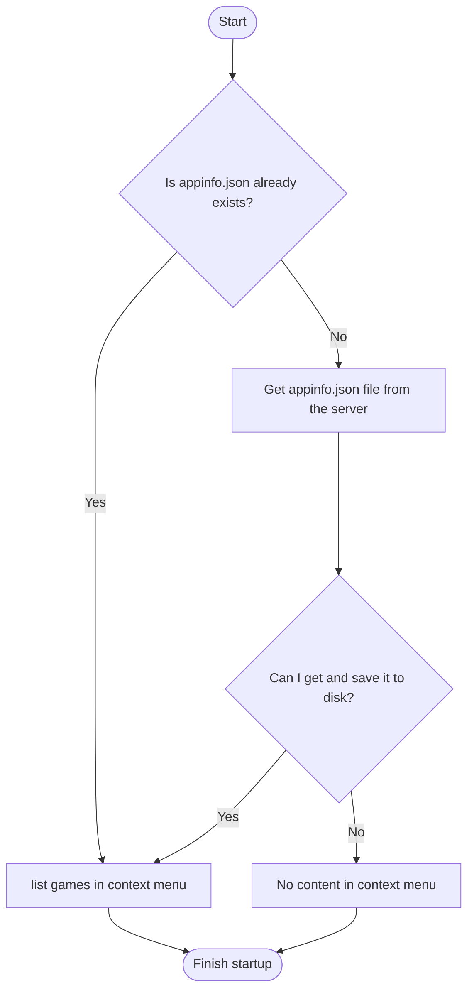
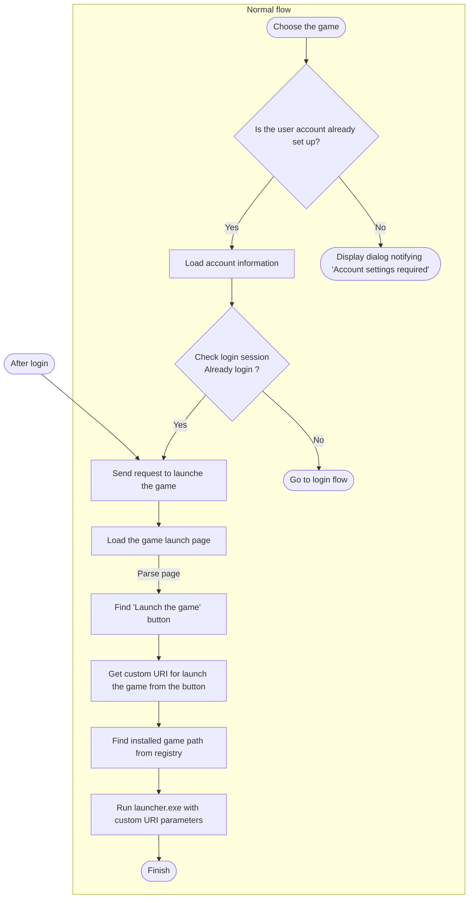
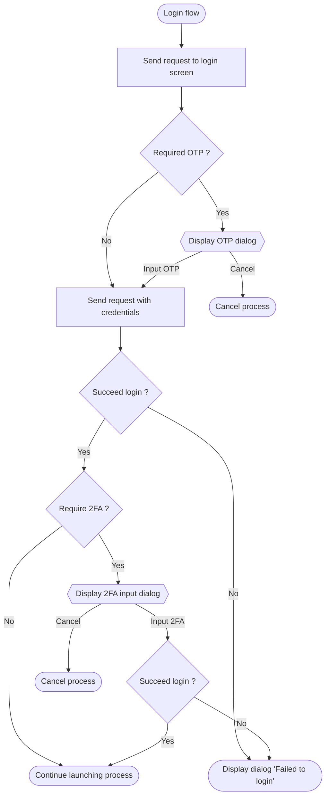

Ks Game Launcher
====
[](https://github.com/anon5r/KSGameLauncher/releases/latest) [](https://github.com/anon5r/KSGameLauncher/releases/latest)
[](https://app.fossa.com/projects/git%2Bgithub.com%2Fanon5r%2FKsGameLauncher?ref=badge_shield)
<a href="https://github.com/anon5r/KSGameLauncher/releases"></a>

[Japanese (日本語)](README.ja-JP.md)


<p align="center">
  <a href="https://github.com/anon5r/KSGameLauncher/releases">
    
  </a>
</p>


# What is this?

This is an application to start the BEMANI for Konaste (コナステ) with one click.

Please check [this document](https://launcher-app.sdvx.net) for details such as operation and functions.

> **Note:** The maintained source is [`src/KsGameLauncher2`](src/KsGameLauncher2) (.NET 10). The original
> `.NET Framework 4.8` project under [`KsGameLauncher`](KsGameLauncher) is deprecated and kept for reference
> only; it is excluded from the solution's default build.


# Development Environment

OS: Microsoft&reg; Windows&trade; 10 or later

Required runtime: [.NET 10 Desktop Runtime](https://dotnet.microsoft.com/download/dotnet/10.0)


## Optional

- Docker


# How can I build this

You can build on your machine with Microsoft&reg; Visual Studio, or the `dotnet` CLI:

```
dotnet build KsGameLauncher.sln
```

NuGet packages are restored automatically as part of the build, so no separate
`nuget restore` step is needed.


## Running the tests

```
dotnet test src/KsGameLauncher2.Tests/KsGameLauncher2.Tests.csproj
```


# How to publish a release

Releases are automated. Pushing a `v*` tag runs the `Release` workflow, which
tests, publishes, zips the output as `ksgamelauncher-<tag>.zip` and attaches it to
a new GitHub release:

```
git tag v1.1.0 && git push origin v1.1.0
```

Note that `update.xml`, which AutoUpdater.NET polls, is hosted outside this
repository and still has to be pointed at the new version by hand.

To produce the same artifact locally, publish it yourself. This produces a single
self-extracting executable (the .NET SDK equivalent of the ILMerge post-build step
the deprecated project used):

```
dotnet publish src/KsGameLauncher2/KsGameLauncher2.csproj -c Release -r win-x64 --self-contained false
```

The output under `bin/Release/net10.0-windows10.0.22000.0/win-x64/publish/` is:

| File | Notes |
| --- | --- |
| `KsGameLauncher2.exe` | Single file, all managed and native dependencies bundled |
| `KsGameLauncher2.dll.config` | Application/user settings defaults |
| `KsGameLauncher2.pdb` | Kept so crash dialogs report file names and line numbers |

Zip those files and attach the archive to the GitHub release — `update.xml` points
AutoUpdater.NET at a `.zip`, so the archive layout must stay flat.

The publish options (`PublishSingleFile`, `IncludeNativeLibrariesForSelfExtract`,
`PublishReferencesDocumentationFiles`) are set in `KsGameLauncher2.csproj`;
`-r win-x64` is passed on the command line so that ordinary builds are not forced
into a runtime-specific output path.


# For debugging

A part of features will be download the data from the server.
To simulate this, we have included a Docker image configuration file for the simple web.


## Build image

```
docker compose build
```

## Create a container, and start

```
docker compose up -d
```

Server will start on port `8080`
Connect to `http://localhost:8080`

`appinfo.json` will be put on `http://localhost:8080/conf/appinfo.json`.


## Stop the container

```
docker compose stop
```

## Remove the container

```
docker compose down
```

## Troubleshoot

If it overlaps with an existing port, change it with `services.web.ports` in` docker-compose.yml`.


# Process flow

### Start up


```mermaid
  flowchart TD;
      A([Start]) --> B{Is appinfo.json already exists?};
      B -- Yes --> E;
      B -- No  --> C[Get appinfo.json file from the server];
      C ----> D{Can I get and save it to disk?};
      D -- Yes --> E[list games in context menu];
      D -- No  --> F[No content in context menu];
      E --> G([Finish startup]);
      F --> G([Finish startup]);
```

### Launch the game


```mermaid
  flowchart TD;
      subgraph Normal flow;
        A([Choose the game]) --> B{Is the user account already set up?};
        B -- Yes --> C[Load account information];
        B -- No  --> D([Display dialog notifying 'Account settings required']);
        C --> E{Check login session\n Already login ?};
        E -- Yes --> F;
        E -- No  --> AA([Go to login flow])
        F[Send request to launche the game] --> G[Load the game launch page];
        G -- Parse page --> H[Find 'Launch the game' button];
        H --> I[Get custom URI for launch the game from the button];
        I --> J[Find installed game path from registry];
        J --> K[Run launcher.exe with custom URI parameters];
        K --> L([Finish]);
      end
      X([After login]) --> F;
```


### Login flow


```mermaid
  flowchart TD;
      Start([Login flow]) --> LoginScreen[Send request to login screen];
      LoginScreen --> ReqOTP{Required OTP ?};
      ReqOTP -- Yes --> OTP{{Display OTP dialog}};
      ReqOTP -- No  --> SendLogin[Send request with credentials];
      OTP -- Input OTP --> SendLogin[Send request with credentials];
      OTP -- Cancel --> Cancel1([Cancel process]);
      SendLogin --> IsSuccess1{Succeed login ?};
      IsSuccess1 -- Yes --> 2FARes{Require 2FA ?};
      IsSuccess1 -- No  --> LoginFail;
      2FARes -- Yes --> 2FA{{Display 2FA input dialog}};
      2FARes -- No  --> Continue([Go to launch process]);
      2FA -- Input 2FA --> IsSuccess2{Succeed login ?};
      2FA -- Cancel --> Cancel2([Cancel process]);
      IsSuccess2 -- Yes --> Continue([Continue launching process]);
      IsSuccess2 -- No  --> LoginFail;
      LoginFail([Display dialog 'Failed to login']);
```

## License
[](https://app.fossa.com/projects/git%2Bgithub.com%2Fanon5r%2FKsGameLauncher?ref=badge_large)