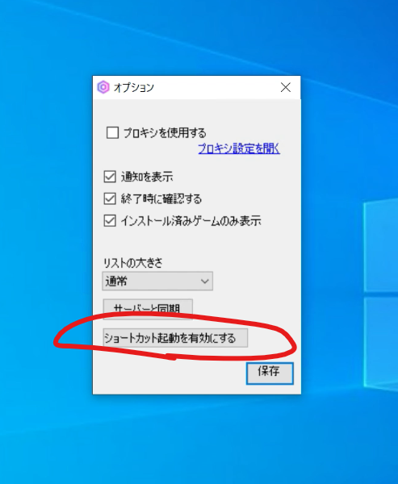
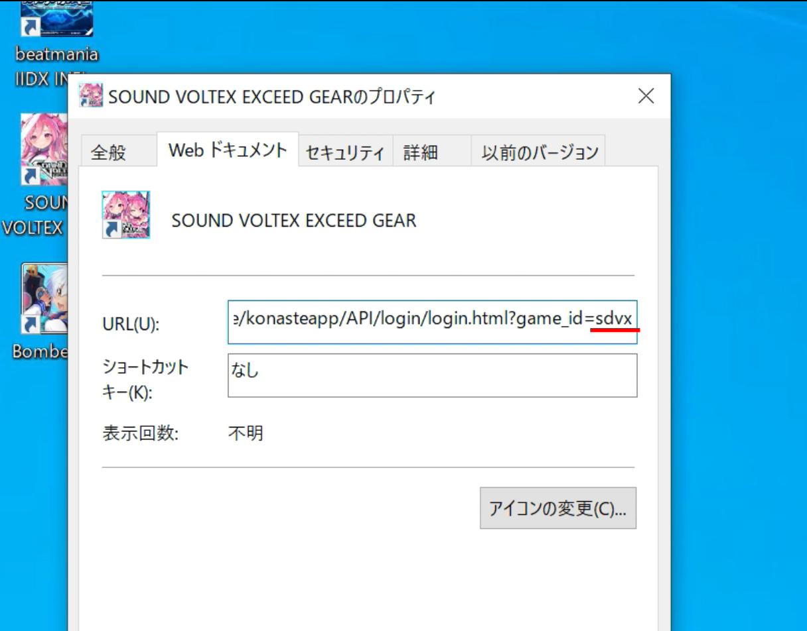
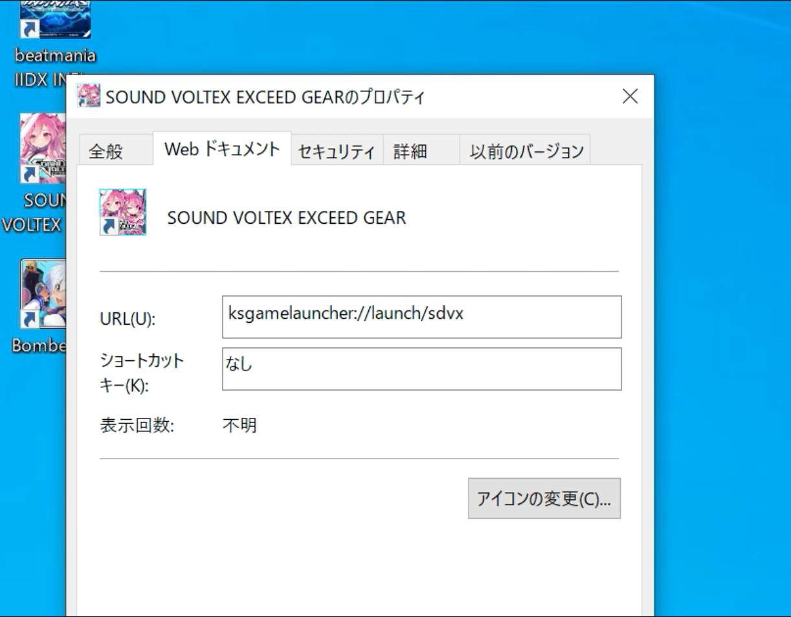

Ks Game Launcher
====

[English](index.md)


## [ここからダウンロードできます](https://github.com/anon5r/KsGameLauncher/releases)

<p align="center">
  
</p>


# これは何？

コナステのゲームをワンクリックで起動するためのアプリケーションです。


## どのような仕組み？

コナステ版音楽ゲームをプレイする際は、ショートカットから一度ブラウザを起動し、画面内のボタンをクリックして初めてゲームランチャーを起動することができます。

画面を行き来したりして少々煩わしいので、コナステにログインするためのアカウントを事前に登録しておき、ゲームは本ツールからワンクリックで起動することができるようにすることができます。


## アカウントの登録とは

コナステにログインするアカウントを事前に登録しておきます。

アカウント情報の入力はツール内から行うことができます。

入力された情報は利用しているコンピューターのOS内で管理されている専用領域（下記から確認可能）に保存されます。

```
コントロール パネル > ユーザー アカウント > 資格情報マネージャー > Windows 資格情報
```


## アカウント情報の利用について

所定の配布元から配布されたものに限り、本ツールを通じて登録されたアカウント情報を
本来の目的（ゲームの起動）以外で通信することはありません。


所定外で配布されたものについては、改変されている可能性を考慮し、上記を保証することはできません。


## ショートカットからの起動

常時起動のランチャーを使用せず、デスクトップのアイコンダブルクリックでゲームを直接起動することができます。


### 1. ショートカットの有効化

タスクバーのランチャーアイコンを右クリックし、オプションを表示します。

オプション画面内の「ショートカット起動を有効にする」をクリックします。
確認ダイアログが表示されるので、内容を確認して問題がなければ「はい」を選択します。



設定できたらアプリは終了してしまっても構いません。


### 2. 作成されたショートカットを編集する

ゲームインストール時に作成されたショートカットファイルを右クリックし、プロパティを開きます。



Web ドキュメントタブのURLで、 `game_id=` の後ろにある文字列をコピーしておきます。
この画像の場合、`sdvx` がそれに該当します。




URLの文字列をすべて削除し、 `ksgamelauncher://launch/` まで入力します。
この文字列の後ろに、先ほどコピーした文字列を貼り付けます。

今回の場合は `ksgamelauncher://launch/sdvx` となります。


このまま「適用」を押し、「OK」を押して閉じます。


### 3. ショートカットをクリックして起動します

ショートカットをダブルクリックすると、瞬間的にKs Game Launcherが起動しますが、すぐに終了します。

その後、ゲームのランチャーが起動します。


### ショートカット起動が不要になった場合

オプション画面からこの機能を無効化してください。
ショートカットを有効にするためにレジストリの一部を更新しているためです。

無効化は１クリックで行えます。


# 実行環境


OS: Microsoft&reg; Windows&trade; 10 Aniversary Update 以上

必要ランタイム: Microsoft&reg; .NET Framework 4.8

インストールが必要な場合はこちらからインストールしてください。
https://docs.microsoft.com/ja-jp/dotnet/framework/install/on-windows-10


# 実行方法

`ksgamelauncher.exe`ファイルを実行してください。

初回のみ、サーバーからJSONファイルをダウンロードします。 
次回はダウンロードされた `appinfo.json` を使用するため、サーバーには接続しません。ただし、ファイルが存在しない場合は再度ダウンロードされます。


# アンインストール

展開されたファイルをすべて削除してください。

## 設定ファイルの削除

完全に削除するには下記のフォルダも削除してください

`%LOCALAPPDATA%\KsGameLauncher`

ここにはアプリの設定が保存されています。


# FAQ


## アカウントIDとパスワードを入力するのが怖い

IDとパスワードは正規のサービスサイトでログイン処理以外で送信されることはありません。
万が一不安がぬぐえない場合、本ランチャーの使用を控えてください。

本ツールはGithub上でオープンソースとして公開しています。
もしコードを読むことができる場合、ソースコードを確認してどのように動作するか確認することができます。

また、Visual Studioを用いてご自身でビルドして実行、確認することもできます。


## IDとパスワードを保存しているが、どこに保存されていますか

Windows OSにある「資格情報マネージャー」という機能を利用し、そこに入力されたIDとパスワードを補完するようにしています。
資格情報マネージャーはコントロールパネルから確認することができます。

使用開始後に疑念を感じた場合、上記から直接アカウント情報を削除することも可能です。


## このツールは規約に違反しませんか？


実際の判断はサービス運営元のコナミの判断にゆだねられますが、
規約としては [PC版コナステ 利用規約](https://p.eagate.573.jp/game/eacloud/p/common/tos_pc.html) の第9条の下記の部分が禁止事項が記載される部分となります。

一部抜粋

```
第9条（禁止事項）
...
(4) 不正ツールを利用あるいは配布した場合。
(5) クライアントソフトを複製、改変、リバースエンジニア、逆コンパイル、逆アセンブル、再現等した場合。
(6) 本サービスを公序良俗および通常の倫理概念に反する方法、用途、目的、ならびに刑法もしくはその他の法律において禁止されている目的において使用した場合。
...
```

本ツールは不正を行うためのものではなく、あくまでもログインからゲームの起動を素早く行うための補助ツールであり、ゲーム本体ならびにプレイに影響を及ぼすものではありません。

また、クライアントソフト（ゲーム本体）を複製、改変、リバースエンジニア、逆コンパイル、逆アセンブルということは行っていません。

公序良俗および通常の倫理概念に反する方法、用途、目的とも考えられず、純粋にゲームを楽に起動したい、起動をワンクリックで行いたいという目的のみとなっています。


## ツールに問題を見つけました

[GithubのIssues](https://github.com/anon5r/KsGameLauncher/issues)から問題の報告をお願いします。

このツールはコナミアミューズメント非公式のものです。コナミアミューズメント様への問い合わせ行わないでください。

